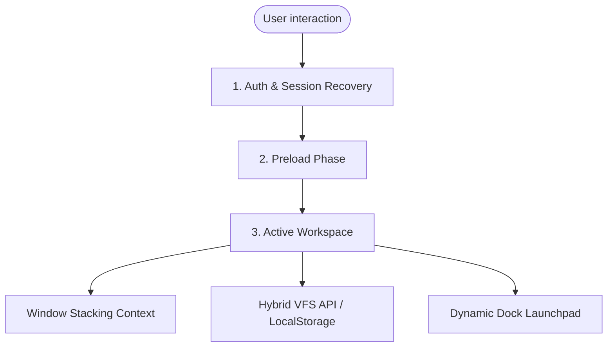
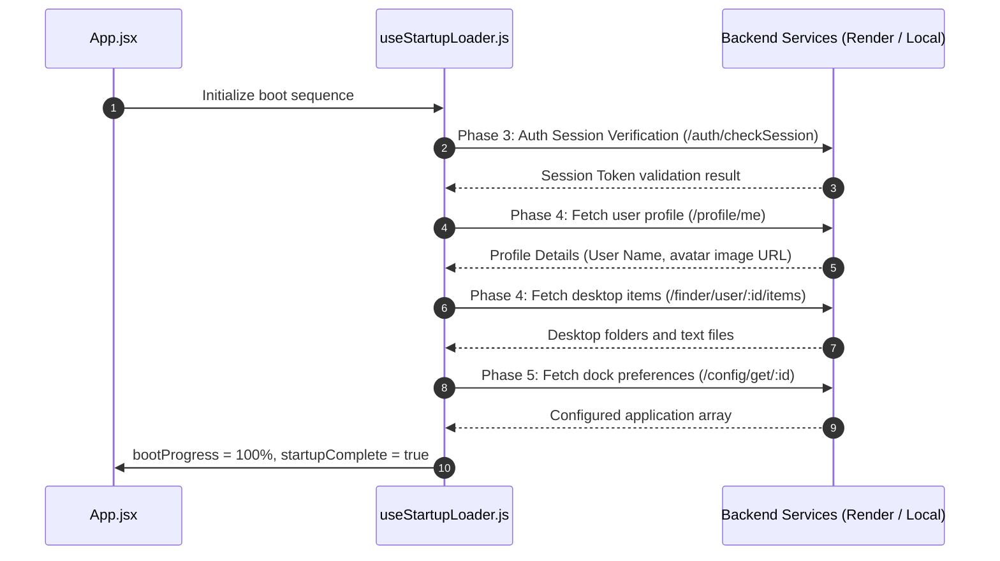
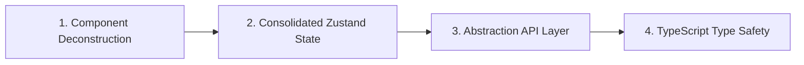

# Cloud Storage OS: Architectural Specification & System Documentation

Welcome to the official developer specification for the **Cloud Storage OS** (macOS Clone). This document acts as the definitive design record, detailing the active system architecture, engineering metrics, technical debt, and a proposed roadmap for modern component design.

---

## 🗺️ System Abstract & User Journey

The Cloud Storage OS is a high-fidelity macOS clone simulation executed entirely inside the browser environment. It is designed to bridge local sandboxed storage experiences with unified cloud backends, enabling users to manage documents, media, and workspaces dynamically from any browser.



---

## 1. 🏗️ Current Architecture

The codebase leverages a client-side routing model utilizing React, Zustand, and React Context. It communicates asynchronously with a hosted API proxy running on Node.js/Express.

### A. Boot & Data Preloading Flow
The startup sequence runs sequentially across six distinct phases managed via `useStartupLoader.js`. This prevents screen tearing and ensures user preferences (e.g. customized dock icons) are retrieved before render.



### B. Core Runtime Architecture
The workspace logic uses three operational subsystems:
1. **Window Manager (`WindowContext.jsx`)**: Keeps track of an active array of window objects, handling focus transitions using a global `zCounter` accumulator (z-indexing), minimized flags, and active instances.
2. **Hybrid Virtual File System (VFS)**: Syncs static structures using local state transformations (`src/state/fs.js`) and live database updates for multi-device parity through `/finder` endpoints.
3. **Application Shell Components**: Individual modules inside `src/components/Apps/` (such as Notepad, Finder, VLC, WhatsApp) rendered inside floating window wrappers with dragging handlers.

---

## 2. 📊 Architecture Evaluation: Pros vs. Cons

The table below provides a rigorous evaluation of the current system design across dimensions of engineering.

| Category | Pros (Strengths) | Cons (Weaknesses) |
| :--- | :--- | :--- |
| **User Experience (UX)** | • Pixel-perfect recreation of macOS windowing, toolbars, and context menu behaviors.<br>• Framer-motion transitions mimic desktop physics. | • Hard-coded interface styling renders poorly on narrower tablet and mobile screens.<br>• Lack of native touch-event translation for window dragging. |
| **State Management** | • State context hooks (`useWindows`) enable effortless window registration.<br>• Zustand file-system store supports offline-first operations. | • Decentralized state structure: Local components contain conflicting file manipulation methods.<br>• Redundant data updates (e.g. copying objects across multiple systems). |
| **API & Data Sync** | • Parallel preloading hook prevents UI stuttering.<br>• Credentials-based session cache allows seamless persistent login. | • Direct Axios/Fetch dependencies embedded inside visual files.<br>• High dependency on API status: Slow cloud backends hold up boot progress. |
| **Maintainability** | • Standard structure: Apps, Components, State, Hooks directories are separated logically. | • File size bloat: Components like `Finder.jsx` and `TopBar.jsx` are monolithic, containing >1,000 lines of mixed concerns. |

---

## 3. 🚨 Identified System Issues & Code Smells

### I. Component Bloat & Mixed Concerns (Monolithic Pattern)
The primary components violate the **Single Responsibility Principle (SRP)**. For example:
* [Finder.jsx](file:///c:/Users/hari9/Desktop/MacOS/macos/src/components/Apps/Finder.jsx) contains `1,420 lines` of code. It manages:
  - Network state (API uploads/downloads).
  - Search queries and sorting algorithms.
  - UI templates, lists, grid coordinates.
  - Layout logic, stylesheet configurations, drag-and-drop overrides.

### II. State Management Fragmentation
* Window instances are tracked using standard React Context state.
* Local files are managed inside a dedicated Zustand store.
* Active files inside Finder are fetched and tracked via isolated component states, creating out-of-sync bugs between the Desktop view and the Finder view.

### III. Hardcoded Endpoint Variables
* Components perform direct requests utilizing imported variables (`BASE_URL`) rather than an abstracted HTTP client layer. If endpoint URLs shift, dozens of code fragments must be modified.

```javascript
// Example of tight backend coupling in Finder.jsx
const res = await axios.get(`${BASE_URL}/finder/folders/${folderId}`, { ... });
```

### IV. Lack of Type Safety & Contract Verification
* Being a standard JavaScript codebase, there is no structural verification. App attributes, database payloads, and API schema shapes lack interfaces, creating runtime errors.

---

## 4. 📈 Needed Improvements

To stabilize, scale, and professionalize the application shell, we must execute the following updates:



1. **Deconstruct Monoliths**: Split Finder, TopBar, and MacOS components into modular, single-responsibility sub-components (e.g., `FinderSidebar`, `FileGrid`, `ControlCenterDropdown`).
2. **Centralize State**: Unify all workspace contexts (windows, active processes, system registry) into a structured Zustand store (`src/state/workspaceStore.ts`).
3. **Abstract Service Layer**: Construct a dedicated API wrapper (e.g. using `axios` interceptors) to handle server handshakes, auth retries, and errors, separating networking from rendering code.
4. **Convert to TypeScript**: Migrate React codebases to TypeScript (`.tsx`/`.ts`) to validate API schemas, file nodes, and window structures.
5. **Optimize Viewports**: Adapt viewport layouts to scale down to a responsive mobile shell (e.g., mimicking an iPadOS/iOS styling on viewport widths < 768px).

---

## 5. 🚀 Preferred Future Architecture

The proposed new architecture introduces a **Modular App Engine** pattern. Instead of hardcoding component logic inside parent viewports, applications are treated as modular plugins registered into an App Engine Core.

### A. Architecture Blueprint
```mermaid
graph TD
    subgraph View Layer (Presentational)
      V[App Shell viewport] --> DockComponent[Dock & Launchpad]
      V --> WindowWrapper[Draggable Window Manager]
    end

    subgraph State Engine (Zustand Domain)
      S[Workspace & Process Store]
      S --> WindowStack[z-Index Stacking & Focus Queue]
      S --> ProcessRegistry[Active Processes List]
      S --> AppConfig[Installed Apps Config]
    end

    subgraph Service & Client Layer (Infrastructure)
      API[Query Client / Axios Core] --> API_Auth[Auth Provider]
      API --> API_VFS[Cloud Drive VFS System]
      API --> OfflineStore[IndexedDB Offline Cache]
    end

    DockComponent -->|launches| S
    WindowWrapper -->|interacts| S
    S -->|calls| API
```

### B. Directory Reorganization Blueprint
A clean, modular directory structure designed to scale with clean separation of concerns:

```text
macos/
├── public/
└── src/
    ├── api/                    # Abstract Service Clients
    │   ├── apiClient.ts        # Axios base with Auth Interceptors
    │   ├── authService.ts      # Authentication Client
    │   └── finderService.ts    # File system CRUD client APIs
    ├── components/             # Reusable Global UI Controls
    │   ├── UI/                 # Atomic design inputs, buttons, sliders
    │   └── Window/             # Window wrapper and dragger handlers
    ├── apps/                   # Self-contained Module Plugins
    │   ├── Finder/
    │   │   ├── components/     # Finder-specific subcomponents
    │   │   ├── hooks/          # Finder local business logic
    │   │   └── FinderApp.tsx   # Entry point for Finder App
    │   ├── Notepad/
    │   └── Terminal/
    ├── hooks/                  # Global React hooks
    ├── store/                  # Unified Zustand State Stores
    │   ├── workspaceStore.ts   # System processes and active windows
    │   └── fileSystemStore.ts  # Cached file systems and operations
    └── App.tsx                 # Main entry point
```

### C. The App Registry Pattern
Instead of hardcoding imports in `Dock.jsx` and importing 20 component files, we introduce an **App Registry Core** that dynamic components load from:

```typescript
// src/store/workspaceStore.ts
export interface AppManifest {
  id: string;
  name: string;
  icon: string;
  component: React.ComponentType<any>;
  singleton: boolean;
}

class AppRegistry {
  private registry = new Map<string, AppManifest>();

  register(manifest: AppManifest) {
    this.registry.set(manifest.id, manifest);
  }

  get(id: string): AppManifest | undefined {
    return this.registry.get(id);
  }

  getAll(): AppManifest[] {
    return Array.from(this.registry.values());
  }
}

export const appRegistry = new AppRegistry();
```

---

## 🛠️ Verification & Verification Protocol

### 1. Automated Testing Suite
For verification of new subsystems, the following test scripts must be run:
```bash
# Execute Jest unit tests verifying workspace state transitions
npm run test:unit

# Run Cypress/Playwright integration tests validating multi-window drag behaviors
npm run test:e2e
```

### 2. Manual Verification Checklists
- Verify that resizing a window triggers a clean throttle on rendering components.
- Ensure that network offline events smoothly fall back to LocalStorage-based stores, avoiding loading screens stuck at 100%.
- Validate credentials caching during full page refresh actions.
